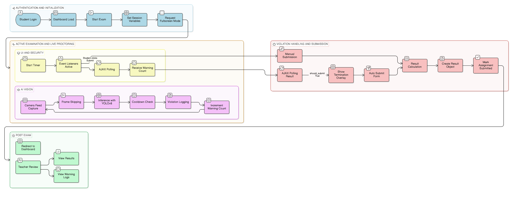

# AI-Based Exam Proctoring System 🛡️🤖
An intelligent, real-time remote proctoring solution designed to ensure academic integrity during online examinations. This system leverages Computer Vision and Deep Learning to monitor candidate behavior and detect potential malpractice without human intervention.

## ✨ Key Features:
Face Verification: Continuous identity checks to prevent impersonation.

Gaze Tracking: Detects if the candidate is looking away from the screen for prolonged periods.

Object Detection: Identifies unauthorized items like mobile phones, books, or additional persons.

Mouth/Speech Detection: Monitors lip movement and audio levels to detect whispering or talking.

Head Pose Estimation: Flags suspicious head movements (e.g., looking down or to the side).

Real-time Alerts: Generates "flags" or logs for the examiner to review post-exam.

## 📊 System Architecture:

  

## 🛠️𝐓𝐞𝐜𝐡 𝐒𝐭𝐚𝐜𝐤:

𝐁𝐚𝐜𝐤𝐞𝐧𝐝:Python, Django.

𝐀𝐈 / 𝐂𝐨𝐦𝐩𝐮𝐭𝐞𝐫 𝐕𝐢𝐬𝐢𝐨𝐧: YOLO26n, OpenCV.

𝐅𝐫𝐨𝐧𝐭𝐞𝐧𝐝: JavaScript, Tailwind CSS, Jinja2.

𝐃𝐚𝐭𝐚𝐛𝐚𝐬𝐞: SQLite / PostgreSQL.

# Snapshots : 
## Admin Dshboard : Admin can create teacher & student user :

## Teacher Dashboard :

## Student Dashboard :

## Proctoring/Live monitoring :

